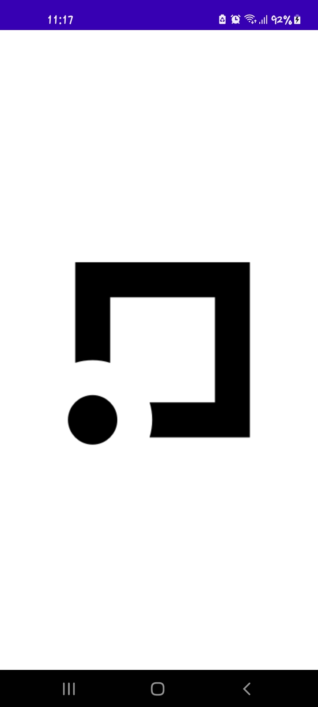

# CLEAR SCORE ANDROID TEST INTERVIEW

Creating ClearScore App using [Android Architecture Components](https://developer.android.com/topic.libraries/architecture), in 100% Kotlin.

The application has included [Clean Architecture by Uncle Bob](https://www.oreilly.com/library/view/clean-architecture-a/9780134494272/) that guides in separation of concerns for easier testing and debugging.

Requirements
------------

The application requires display of a donut with a user's credit score. An outline of the score should indicate the users score

Technologies Used
-----------------

* The application has been built with the following:
   
    * [Kotlin](https://kotlinlang.org/)
    * [Coroutines](https://kotlinlang.org/docs/reference/coroutines-overview.html)
    * [Flow](https://kotlinlang.org/docs/reference/coroutines/flow.html)
    * [Jetpack](https://developer.android.com/jetpack)
       * [Lifecycle](https://developer.android.com/topic/libraries/architecture/lifecycle)
       * [ViewModel](https://developer.android.com/topic/libraries/architecture/viewmodel)
   * [Dagger-Hilt](https://dagger.dev/hilt/)
    

* Architecture
    * App Architecture - MVVM + Clean Architecture
  
* Tests
    * [JUnit5](https://junit.org/junit5/)

### APP PREVIEW

I added some screenshots in the `screenshots` folder, in the root directory of the project.

Splash | Loading | Success | Error
------ | ------- | ------- | -----
 |  |  | 